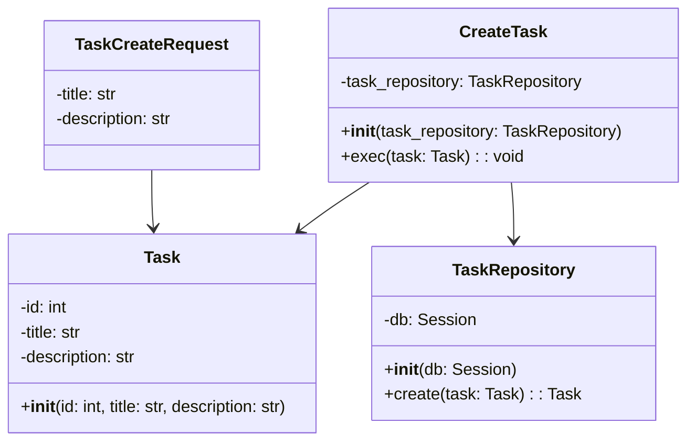

```mermaid
classDiagram
    class Task {
        -id: int
        -title: str
        -description: str
        +__init__(id: int, title: str, description: str)
    }

    class TaskCreateRequest {
        -title: str
        -description: str
    }

    class TaskRepository {
        -db: Session
        +__init__(db: Session)
        +create(task: Task): Task
    }

    class CreateTask {
        -task_repository: TaskRepository
        +__init__(task_repository: TaskRepository)
        +exec(task: Task): void
    }

    TaskCreateRequest --> Task
    CreateTask --> TaskRepository
    CreateTask --> Task
```