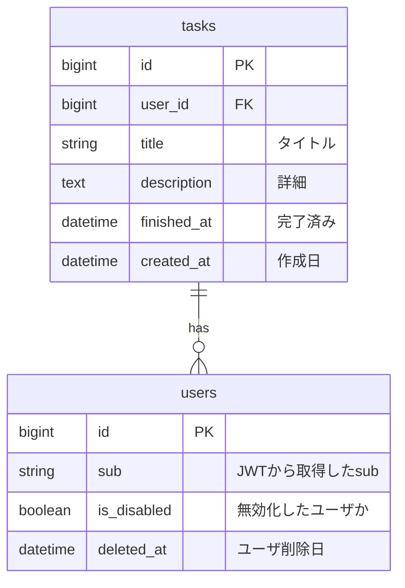

```mermaid
erDiagram

tasks {
  bigint id PK
  bigint user_id FK
  string title "タイトル"
  text description "詳細"
  datetime finished_at "完了済み"
  datetime created_at "作成日"
}

users {
  bigint id PK
  string sub "JWTから取得したsub"
  boolean is_disabled "無効化したユーザか"
  datetime deleted_at "ユーザ削除日"
}

tasks ||--o{ users : has
```